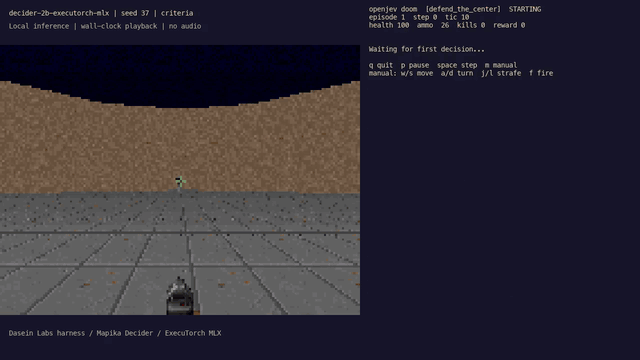

# Doom in the terminal

`demo/doom/` runs ViZDoom headless, describes each frame in a line of text, and
lets the server rank the action menu with one `/score` call (or one System One
`choice` question). Nothing is generated: one prefill per decision, one padded
forward pass over the menu, argmax, press the keys, repeat.

[](media/decider-2b-demo.mp4)

[30-second Decider 2B MP4](media/decider-2b-demo.mp4). This fork's recording uses
the Decider MLX backend; the upstream Gemma instructions below remain for reference.

```
ViZDoom frame ──> labels + depth buffer ──> "A zombie on the left, close. ..."
                                                  │
        press keys for N tics  <── argmax <── POST /score (or /v1/systemone)
```

The frame is drawn in the terminal with 24-bit half-block characters. The
right-hand panel shows the option probabilities the server returned, the action
pressed, the latency, and the situation text the model read.

## Run it

```sh
make setup            # includes the `doom` extra (vizdoom, ships freedoom2.wad)
make serve            # terminal 1: load the model once
make doom             # terminal 2: model plays defend_the_center
```

Or drive `play.py` directly:

```sh
.venv/bin/python demo/doom/play.py                                   # defend_the_center via /score
.venv/bin/python demo/doom/play.py --scenario deadly_corridor        # harder
.venv/bin/python demo/doom/play.py --api systemone --api-key local   # System One choice question
.venv/bin/python demo/doom/play.py --temperature 0.7 --record run.jsonl
.venv/bin/python demo/doom/play.py --manual                          # you drive, the panel shows what the model would do
```

!!! note "`make doom` variables"
    The `doom` target defaults to `SCENARIO=defend_the_center` and `API=score`
    and passes them through to `play.py`. Override them on the command line,
    e.g. `make doom SCENARIO=deadly_corridor API=systemone`. `API_KEY`
    defaults to `local`.

## Keys while it runs

| key | effect |
|---|---|
| `q` | quit |
| `p` | pause / resume |
| `space` | single step while paused |
| `m` | toggle manual control (model still ranks each step) |
| `w` `s` | move forward / backward (manual) |
| `a` `d` | turn left / right (manual) |
| `j` `l` | strafe left / right (manual) |
| `f` | fire (manual) |

## Scenarios

`--scenario` accepts `defend_the_center` (the default), `deadly_corridor`,
`basic`, `health_gathering`, and `level`.

The first four are small research arenas that ship with ViZDoom. `level` loads
an actual level — map01 of the bundled `freedoom2.wad` by default. If you own
Doom or Doom II, point at the real data:

```sh
.venv/bin/python demo/doom/play.py --wad ~/games/doom2.wad --map map01
.venv/bin/python demo/doom/play.py --wad ~/games/doom.wad  --map e1m1
```

`--wad` or `--map` implies `--scenario level`.

## How the decision is made

`describe.py` turns the ViZDoom labels buffer (which actors are on screen and
where) and the depth buffer (how far the walls are) into one line of text, for
example:

```
Situation: A chainsaw marine slightly left of center, close. No items in view.
Straight ahead: open space. Left: open space. Right: open space.
Health 100, ammo 26, kills 0. Last action: turn right.
->
```

With `--api score` the context is the scenario goal, a few rules of thumb, a
handful of worked `Situation -> action` examples, and the live situation. The
menu (`" attack"`, `" turn left"`, `" turn right"`) is scored as the
continuation after `->`.

With `--api systemone` the same observation is sent as a structured `state`
object with one `choice` question whose criteria are the actions; the server
renders its own prompt and returns `choice`, `probabilities` and `confidence`.

### Two details that matter for a scorer

- **Options carry their own leading space.** Sending `sep=" "` makes the
  tokenizer emit a lone space token, which never occurs mid-sentence in
  training data. Every option then scores around -20 nats and the ranking is
  noise.
- **The examples do the work.** Without them a 4B base model has a fixed prior
  (always turn, or always attack once the menu is in the prompt). With five
  examples the ranking tracks where the monster is. This is Route B from the
  [design notes](design/one-pass-option-scoring.md): plausible-as-continuation
  is the signal, and the prompt shapes it.

## Recording runs

`--record` writes one JSON line per decision (`context`, `options`,
`probabilities`, `action`, `source`, `reward`), which is the jevlike training
format if you want to go from Route B to [Route A](training.md) later.

## Files

| file | contents |
|---|---|
| `demo/doom/play.py` | loop, keyboard, CLI |
| `demo/doom/game.py` | ViZDoom setup, action vocabulary, per-scenario menus, rules and examples |
| `demo/doom/describe.py` | snapshot to text / structured state |
| `demo/doom/client.py` | `/score` and `/v1/systemone` calls (standard library only) |
| `demo/doom/render.py` | ANSI half-block frame and panel |
